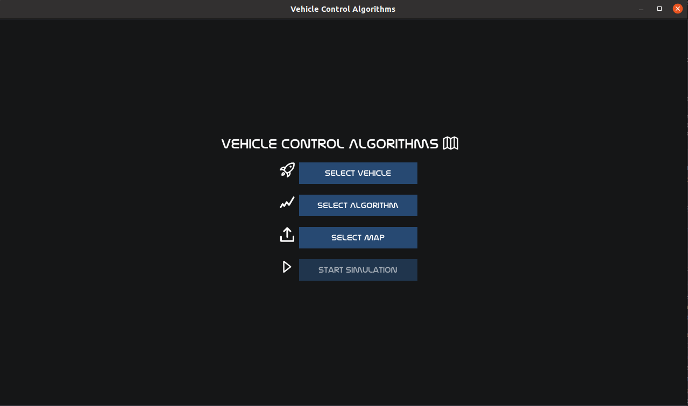
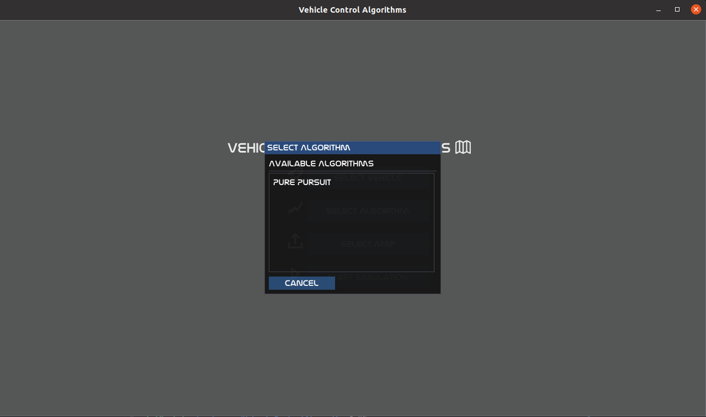
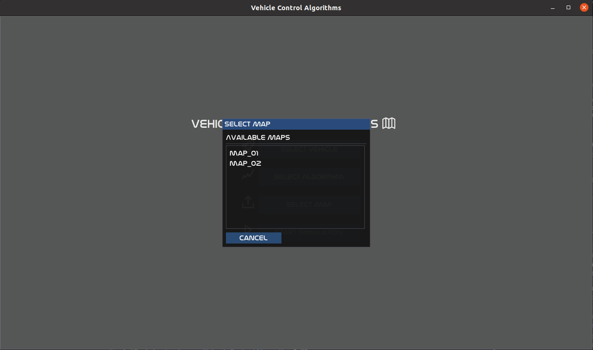
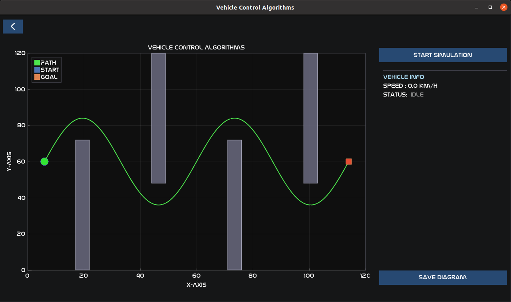
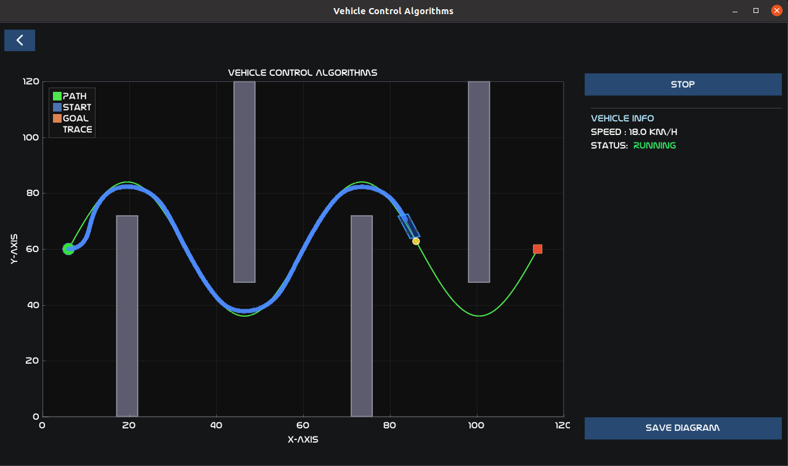

# Vehicle Control Algorithms

A desktop simulation environment for visualizing and testing vehicle path-tracking algorithms.
Built with C++17, Dear ImGui, ImPlot, GLFW, and OpenGL 3.3.

---

## Features

- **Main screen** — select a vehicle model, a path-tracking algorithm, and a map before launching the simulation.
- **Simulation screen** — displays the loaded map (obstacles, start, goal) and the pre-computed reference path on an interactive Cartesian plot.
- **JSON-driven configuration** — vehicles, maps, and paths are defined in plain JSON files; no recompilation needed to add new scenarios.
- **Auto-discovery** — the UI automatically lists all vehicle files and map directories found under `data/`.

---

## Project Structure

```
VehicleControlAlgorithms/
├── CMakeLists.txt
├── data/
│   ├── maps/
│   │   ├── map_01/          # Corridor Map  (straight corridor with gaps)
│   │   │   ├── map.json
│   │   │   └── path.json
│   │   └── map_02/          # Sine Wave Course  (two-period sinusoidal weave)
│   │       ├── map.json
│   │       └── path.json
│   └── vehicle/
│       └── vehicle01.json   # Bus 01 dynamics & geometry
├── include/
│   ├── assets/
│   │   ├── fonts/           # Nasalization TrueType font
│   │   └── icons/           # Dripicons v2 font + dripicon_v2_icons.hpp
│   ├── map/
│   │   ├── map_data.hpp     # MapData, PathData, Point2D, Obstacle structs
│   │   └── map_loader.hpp   # MapLoader — loads map.json + path.json, discovers maps
│   ├── path_tracking/
│   │   └── pure_pursuit/
│   │       └── pure_pursuit.hpp   # PurePursuit class
│   ├── vehicle/
│   │   ├── vehicle_data.hpp       # VehicleData struct (dynamics + geometry)
│   │   └── vehicle_loader.hpp     # VehicleLoader — loads vehicle JSON, discovers vehicles
│   ├── third_parties/       # ImGui, ImPlot, stb_image (vendored)
│   └── vehicle_control_ui.hpp
└── src/
    ├── main.cpp
    ├── vehicle_control_ui.cpp
    ├── map/
    │   └── map_loader.cpp
    ├── path_tracking/
    │   └── pure_pursuit/
    │       └── pure_pursuit.cpp
    └── vehicle/
        └── vehicle_loader.cpp
```

---

## Dependencies

| Library | Version | Notes |
|---------|---------|-------|
| GLFW    | 3.x     | `sudo apt install libglfw3-dev` |
| OpenGL  | 3.3+    | Usually provided by GPU driver |
| Dear ImGui | 1.9x | Vendored under `include/third_parties/imgui/` |
| ImPlot  | 0.17+   | Vendored under `include/third_parties/implot/` |
| stb_image | —    | Vendored under `include/third_parties/stb/` |

---

## Build

```bash
mkdir build && cd build
cmake .. -DCMAKE_BUILD_TYPE=Release
make -j$(nproc)
./vehicle_control_algorithms
```

---

## Example Usage

### 1. Launch and configure

On startup the main menu presents four steps. **Start Simulation** stays disabled until all three selections have been made.



---

### 2. Select a vehicle

Click **Select Vehicle** to open the picker. All JSON files found under `data/vehicle/` are listed automatically. Select `vehicle01` to load the Bus 01 model.


---

### 3. Select an algorithm

Click **Select Algorithm** and choose the path-tracking controller to use. Currently **Pure Pursuit** is available.



---

### 4. Select a map

Click **Select Map** to see all map directories discovered under `data/maps/`. Choose `map_01` (Corridor Map) or `map_02` (Sine Wave Course).



---

### 5. Simulation screen — ready

Once all three selections are confirmed, click **Start Simulation** from the main menu to enter the simulation screen. The 120 m × 120 m map is drawn with obstacles (grey), the reference path (green), the start marker (circle) and the goal marker (square). The right panel shows vehicle speed and status. Click **Start Simulation** in the right panel to begin.



---

### 6. Pure Pursuit running

With the simulation running the vehicle (blue rectangle) follows the reference path. The yellow dot is the current lookahead target; the blue dot trail shows where the rear axle has been. Speed and status update in real time in the right panel. Click **Stop** to pause or **Restart** to run again from the start position.



> A screen-capture video of the full run is available at `docs/pics/path_tracking/pure_pursuit/pure_pursuit.mp4`.

---

## Adding a New Map

1. Create a directory under `data/maps/`, e.g. `data/maps/map_03/`.
2. Add `map.json` following the schema:

```json
{
  "name": "My Map",
  "world": { "width": 12.0, "height": 6.0 },
  "start": { "x": 0.5, "y": 3.0 },
  "goal":  { "x": 11.5, "y": 3.0 },
  "vehicle_radius": 0.2,
  "obstacles": [
    { "id": "wall_a", "shape": "rectangle", "x": 2.0, "y": 0.0, "width": 0.5, "height": 3.0 }
  ]
}
```

3. Add `path.json` in the same directory:

```json
{
  "map_name": "My Map",
  "algorithm": "A*",
  "waypoints": [
    { "x": 0.5, "y": 3.0 },
    { "x": 11.5, "y": 3.0 }
  ]
}
```

The map will appear automatically in the **Select Map** popup at next launch.

---

## Adding a New Vehicle

Create a JSON file under `data/vehicle/`, e.g. `data/vehicle/vehicle02.json`:

```json
{
  "name": "My Vehicle",
  "mass": 1500.0,
  "a": 1.2,
  "b": 1.3,
  "CA": 0.00045,
  "minimum_turning_radius": 5.5,
  "max_steering_wheel_angle": 720.0,
  "min_steering_wheel_angle": -720.0,
  "max_steering_wheel_rate": 400.0,
  "wheelbase": 2.5,
  "wheel_radius": 0.32,
  "wheel_width": 0.20,
  "wheel_tread": 1.55,
  "front_overhang": 0.85,
  "rear_overhang": 0.75,
  "left_overhang":  0.10,
  "right_overhang": 0.10,
  "vehicle_height": 1.45
}
```

| Field | Description | Unit |
|-------|-------------|------|
| `mass` | Vehicle mass | kg |
| `a` | Distance from **front axle** to COG. COG position from vehicle front = `front_overhang + a`. For Bus 01: 2.37 + 2.0 = 4.37 m (~50 % of total length 8.72 m) | m |
| `b` | Distance from **rear axle** to COG. Must satisfy `a + b = wheelbase`. For Bus 01: 2.0 + 2.335 = 4.335 m | m |
| `CA` | Mass-normalised aerodynamic drag coefficient. Formula: `CA = (0.5 × ρ × Cd × Af) / mass` where ρ = 1.225 kg/m³, Af = vehicle width × height. Typical Cd: passenger car 0.25–0.30, SUV 0.30–0.35, bus 0.60–0.80. For Bus 01: Cd = 0.70, Af = 2.47 × 3.09 = 7.63 m² → CA = (0.5 × 1.225 × 0.70 × 7.63) / 8300 = 0.000394 | 1/m |
| `minimum_turning_radius` | Minimum kinematic turning radius | m |
| `max/min_steering_wheel_angle` | Steering wheel travel limits | deg |
| `max_steering_wheel_rate` | Maximum steering rate | deg/s |
| `wheelbase` | Front-to-rear axle distance | m |
| `wheel_radius` | Loaded tyre radius | m |
| `wheel_width` | Tyre section width | m |
| `wheel_tread` | Left-to-right wheel-centre distance | m |
| `front/rear_overhang` | Axle centre to vehicle body end | m |
| `left/right_overhang` | Wheel centre to vehicle body side | m |
| `vehicle_height` | Overall height | m |

---

## Adding a New Path-Tracking Algorithm

1. Create `include/path_tracking/<algo>/<algo>.hpp` and `src/path_tracking/<algo>/<algo>.cpp`.
2. Add the source file to `CMakeLists.txt`.
3. Add the display name to `kAvailableAlgorithms` in `src/vehicle_control_ui.cpp`.

---

## Included Maps

| Map | Description |
|-----|-------------|
| **map_01** — Corridor Map | 120 m × 120 m. Three pairs of offset wall segments create a slalom. Tests gap navigation with large heading changes. |
| **map_02** — Sine Wave Course | 120 m × 120 m. Two-period sinusoidal weave (amplitude ±24 m, period 54 m). Four alternating baffles force the path high and low. |

---

## Included Algorithms

| Algorithm | Status |
|-----------|--------|
| Pure Pursuit | Implemented — `PurePursuit::ComputeSteering()` returns wheel angle from look-ahead point |

---