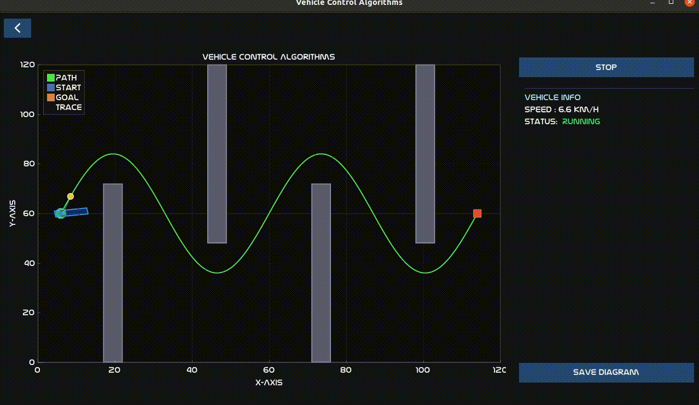

# Vehicle Control Algorithms

A desktop simulation environment for visualising and testing vehicle path-tracking algorithms.
Built with C++17, Dear ImGui, ImPlot, GLFW, and OpenGL 3.3.

---

## Features

- **Main screen** — select a vehicle model, a path-tracking algorithm, and a map before launching the simulation.
- **Simulation screen** — displays the loaded map (obstacles, start, goal) and the pre-computed reference path on an interactive Cartesian plot.
- **Live parameter tuning** — right panel contains per-algorithm sliders that can override the JSON defaults mid-simulation. Enable with the **Override Defaults** checkbox; each slider applies its new value the moment the mouse is released.
- **Hover tooltips** — hovering any parameter slider (while Override is active) shows a semi-transparent description of what the parameter controls. The tooltip fades out 0.25 s after the cursor moves away.
- **Real-time telemetry** — speed (km/h) and steering angle (deg) are displayed live in the right info panel.
- **JSON-driven configuration** — vehicles, maps, paths, and algorithm parameters are all defined in plain JSON files; no recompilation needed to add or tune scenarios.
- **Auto-discovery** — the UI automatically lists all vehicle files and map directories found under `data/`.
- **Application icon** — the window and dock entry display the project icon (`vca_application_icon.png`).

---

## Project Structure

```
VehicleControlAlgorithms/
├── CMakeLists.txt
├── config/
│   └── path_tracking/
│       ├── adaptive_pure_pursuit.json
│       ├── lqr.json
│       ├── mpc.json
│       ├── mppi.json
│       ├── pure_pursuit.json
│       └── stanley.json
├── data/
│   ├── maps/
│   │   ├── map_01/          # Corridor Map
│   │   │   ├── map.json
│   │   │   └── path.json
│   │   ├── map_02/          # Sine Wave Course
│   │   │   ├── map.json
│   │   │   └── path.json
│   │   └── map_03/          # Trapezoidal Course
│   │       ├── map.json
│   │       └── path.json
│   └── vehicle/
│       ├── vehicle01.json   # Bus 01 — city bus dynamics & geometry
│       └── vehicle02.json   # Car 01 — passenger car dynamics & geometry
├── docs/
│   ├── lqr.md
│   ├── pipeline.md
│   └── pure_pursuit.md
├── include/
│   ├── assets/
│   │   ├── fonts/           # Nasalization TrueType font
│   │   ├── icons/           # Dripicons v2 font + dripicon_v2_icons.hpp
│   │   └── images/          # Application icon (vca_application_icon.png)
│   ├── map/
│   │   ├── map_data.hpp     # MapData, PathData, Point2D, Obstacle structs
│   │   └── map_loader.hpp   # MapLoader — loads map.json + path.json, discovers maps
│   ├── path_tracking/
│   │   ├── adaptive_pure_pursuit/
│   │   ├── lqr/
│   │   ├── mpc/
│   │   ├── mppi/
│   │   ├── pure_pursuit/
│   │   ├── stanley/
│   │   ├── config_reader.hpp          # Shared JSON key/value parser
│   │   └── path_tracking_algorithm.hpp # IPathTrackingAlgorithm interface
│   ├── vehicle/
│   │   ├── vehicle_bicycle_model.hpp  # KinematicBicycleModel
│   │   ├── vehicle_data.hpp           # VehicleData struct
│   │   ├── vehicle_loader.hpp         # VehicleLoader
│   │   └── vehicle_state.hpp          # VehicleState, VehicleControls
│   ├── third_parties/       # ImGui, ImPlot, stb_image (vendored)
│   └── vehicle_control_ui.hpp
└── src/
    ├── main.cpp
    ├── vehicle_control_ui.cpp
    ├── map/
    │   └── map_loader.cpp
    ├── path_tracking/
    │   ├── adaptive_pure_pursuit/
    │   ├── lqr/
    │   ├── mpc/
    │   ├── mppi/
    │   ├── pure_pursuit/
    │   └── stanley/
    └── vehicle/
        ├── vehicle_bicycle_model.cpp
        └── vehicle_loader.cpp
```

---

## Dependencies

| Library | Version | Notes |
|---------|---------|-------|
| GLFW    | 3.x     | `sudo apt install libglfw3-dev` |
| OpenGL  | 3.3+    | Usually provided by GPU driver |
| Dear ImGui | 1.9x | Vendored under `include/third_parties/imgui/` |
| ImPlot  | 0.17+   | Vendored under `include/third_parties/implot/` |
| stb_image | —    | Vendored under `include/third_parties/stb/` |

---

## Build

```bash
mkdir build && cd build
cmake .. -DCMAKE_BUILD_TYPE=Release
make -j$(nproc)
./vehicle_control_algorithms
```

---

## Running with Docker

Docker lets you build and run the simulation on **Ubuntu 20, 22, 24, and Windows 11** without setting up a local build environment. The image is based on Ubuntu 22.04 and works on any of these hosts.

> **Why display forwarding?** Docker containers are headless by default. This application opens a real OpenGL window, so the container must forward its display output to the host's screen via X11.

### Prerequisites

- [Docker Engine](https://docs.docker.com/engine/install/) (Linux) **or** [Docker Desktop](https://www.docker.com/products/docker-desktop/) with WSL2 backend (Windows 11)
- Docker Compose plugin (`docker compose` — included with Docker Desktop and recent Docker Engine installs)

### Build the image

```bash
docker build -t vehicle-control-algorithms .
```

The multi-stage build compiles the project in a temporary builder stage and copies only the binary and runtime assets into the final image (~120 MB).

---

### Run on Linux (Ubuntu 20 / 22 / 24)

Allow Docker to connect to your local X server, then launch with Compose:

```bash
xhost +local:docker
docker compose up
```

Close the application window to stop the container. To revoke the X server permission afterwards:

```bash
xhost -local:docker
```

---

### Run on Windows 11

Windows 11 includes **WSLg** (WSL GUI support), which provides a built-in X/Wayland display server for WSL2 workloads. The easiest path is to run Docker from inside a WSL2 terminal, where the display is already set up automatically.

**Step 1 — Install WSL2 with Ubuntu** (skip if already done):
```powershell
# Run in PowerShell as Administrator
wsl --install -d Ubuntu-22.04
```

**Step 2 — Install Docker inside WSL2**:

Open the Ubuntu terminal and follow the [Docker Engine install guide for Ubuntu](https://docs.docker.com/engine/install/ubuntu/).

Alternatively, install [Docker Desktop](https://www.docker.com/products/docker-desktop/) on Windows and enable **WSL2 integration** for your Ubuntu distribution in *Settings → Resources → WSL Integration*.

**Step 3 — Run from the WSL2 Ubuntu terminal**:
```bash
# Clone or navigate to the project inside WSL2
xhost +local:docker
docker compose up
```

The OpenGL window will appear on your Windows desktop via WSLg, just like any other WSL GUI application.

---

### Customise configs without rebuilding

The `config/` and `data/` directories are baked into the image at build time. To edit algorithm parameters or add maps/vehicles without rebuilding, mount your local directories over the image copies:

```bash
xhost +local:docker
docker run --rm \
  -e DISPLAY=$DISPLAY \
  -v /tmp/.X11-unix:/tmp/.X11-unix:rw \
  -v "$(pwd)/config":/app/config \
  -v "$(pwd)/data":/app/data \
  --network host \
  vehicle-control-algorithms
```

---

### Troubleshooting

**`No protocol specified` / `GLFW Error 65544: X11: Failed to open display`**

The container couldn't authenticate with your host's X server. Run `xhost +local:docker` in a terminal on the host before starting the container (this is a per-login-session setting, so it's easy to forget after a reboot or after closing the terminal it was set in). Revoke access afterwards with `xhost -local:docker`.

---

## Example Usage

### 1. Launch and configure

On startup the main menu presents four steps. **Start Simulation** stays disabled until all three selections have been made.


---

### 2. Select a vehicle

Click **Select Vehicle** to open the picker. All JSON files found under `data/vehicle/` are listed automatically.

| File | Description |
|------|-------------|
| `vehicle01` | Bus 01 — 8 300 kg city bus, 4.335 m wheelbase |
| `vehicle02` | Car 01 — 1 500 kg passenger car, 2.6 m wheelbase |


---

### 3. Select an algorithm

Click **Select Algorithm** and choose the path-tracking controller to use.

| Algorithm | Description |
|-----------|-------------|
| Pure Pursuit | Geometric look-ahead controller |
| Adaptive Pure Pursuit | Look-ahead scales with speed and path curvature |
| LQR | Optimal state-feedback via discrete Riccati equation |
| Stanley | Front-axle geometry with cross-track + heading correction |
| MPC | Gradient-descent model predictive control |
| MPPI | Sampling-based model predictive path integral control |


---

### 4. Select a map

Click **Select Map** to see all map directories discovered under `data/maps/`.


---

### 5. Simulation screen

Once all three selections are confirmed, click **Start Simulation** from the main menu. The map is drawn with obstacles (grey), the reference path (green), the start marker (circle), and the goal marker (square). The right panel shows the Simulation Info and Parameter Tuning sections.

Click **Start Simulation** in the right panel to begin.


---

### 6. Live parameter tuning

The **Parameter Tuning** section in the right panel is available at all times on the simulation screen:

1. Check **Override Defaults** — the checkbox turns green and all sliders for the active algorithm become interactive.
2. Drag any slider to the desired value. The algorithm is rebuilt with the new value the moment you release the mouse button.
3. Hover a slider to see a description tooltip that fades out 0.25 s after the cursor moves away.
4. Uncheck **Override Defaults** to restore JSON defaults on the next simulation start.

When Override is not enabled, sliders are visible but greyed out, showing the currently loaded default values.

---

### 7. Pure Pursuit running

With the simulation running the vehicle (blue rectangle) follows the reference path. The yellow dot is the current lookahead target; the blue dot trail shows where the rear axle has been. Speed and steering angle update in real time in the right panel. Click **Stop** to pause or **Restart** to run again from the start position.




---

## Adding a New Map

1. Create a directory under `data/maps/`, e.g. `data/maps/map_04/`.
2. Add `map.json` following the schema:

```json
{
  "name": "My Map",
  "world": { "width": 12.0, "height": 6.0 },
  "start": { "x": 0.5, "y": 3.0 },
  "goal":  { "x": 11.5, "y": 3.0 },
  "vehicle_radius": 0.2,
  "obstacles": [
    { "id": "wall_a", "shape": "rectangle", "x": 2.0, "y": 0.0, "width": 0.5, "height": 3.0 }
  ]
}
```

3. Add `path.json` in the same directory:

```json
{
  "map_name": "My Map",
  "algorithm": "A*",
  "waypoints": [
    { "x": 0.5, "y": 3.0 },
    { "x": 11.5, "y": 3.0 }
  ]
}
```

The map will appear automatically in the **Select Map** popup at next launch.

---

## Adding a New Vehicle

Create a JSON file under `data/vehicle/`, e.g. `data/vehicle/vehicle03.json`:

```json
{
  "name": "My Vehicle",
  "mass": 1500.0,
  "a": 1.2,
  "b": 1.3,
  "CA": 0.00045,
  "minimum_turning_radius": 5.5,
  "max_steering_wheel_angle": 720.0,
  "min_steering_wheel_angle": -720.0,
  "max_steering_wheel_rate": 400.0,
  "steering_wheel_to_tire_angle_ratio": 14.0,
  "wheelbase": 2.5,
  "wheel_radius": 0.32,
  "wheel_width": 0.20,
  "wheel_tread": 1.55,
  "front_overhang": 0.85,
  "rear_overhang": 0.75,
  "left_overhang":  0.10,
  "right_overhang": 0.10,
  "vehicle_height": 1.45
}
```

| Field | Description | Unit |
|-------|-------------|------|
| `mass` | Vehicle mass | kg |
| `a` | Distance from **front axle** to COG | m |
| `b` | Distance from **rear axle** to COG. Must satisfy `a + b = wheelbase` | m |
| `CA` | Mass-normalised aerodynamic drag coefficient: `(0.5 × ρ × Cd × Af) / mass` | 1/m |
| `minimum_turning_radius` | Minimum kinematic turning radius | m |
| `max/min_steering_wheel_angle` | Steering wheel travel limits | deg |
| `max_steering_wheel_rate` | Maximum steering rate | deg/s |
| `steering_wheel_to_tire_angle_ratio` | Steering ratio (steering wheel deg / tyre deg) | — |
| `wheelbase` | Front-to-rear axle distance | m |
| `wheel_radius` | Loaded tyre radius | m |
| `wheel_width` | Tyre section width | m |
| `wheel_tread` | Left-to-right wheel-centre distance | m |
| `front/rear_overhang` | Axle centre to vehicle body end | m |
| `left/right_overhang` | Wheel centre to vehicle body side | m |
| `vehicle_height` | Overall height | m |

---

## Adding a New Path-Tracking Algorithm

1. Create `include/path_tracking/<algo>/<algo>.hpp` and `src/path_tracking/<algo>/<algo>.cpp` implementing `IPathTrackingAlgorithm`.
2. Create `include/path_tracking/<algo>/<algo>_loader.hpp` and `src/path_tracking/<algo>/<algo>_loader.cpp`.
3. Add `config/path_tracking/<algo>.json` with the default parameters.
4. Add the source files to `CMakeLists.txt`.
5. Add the display name to `kAvailableAlgorithms` in `src/vehicle_control_ui.cpp`.
6. Add a JSON-loading block and a tuning struct to `InitSimulation()` / `RebuildAlgorithm()` in `vehicle_control_ui.cpp`, following the pattern of the existing algorithms.
7. Add a slider block for the new algorithm inside `RenderParamTuning()`.

---

## Included Maps

| Map | Description |
|-----|-------------|
| **map_01** — Corridor Map | 120 m × 120 m. Three pairs of offset wall segments create a slalom. Tests gap navigation with large heading changes. |
| **map_02** — Sine Wave Course | 120 m × 120 m. Two-period sinusoidal weave (amplitude ±24 m, period 54 m). Four alternating baffles force the path high and low. |
| **map_03** — Trapezoidal Course | 120 m × 120 m. A large central block flanked by corner barriers forces the path around a trapezoidal circuit. Tests multi-turn navigation and constrained start/goal positions. |

---

## Included Algorithms

| Algorithm | Config file | Key parameters |
|-----------|-------------|----------------|
| **Pure Pursuit** | `pure_pursuit.json` | `lookahead_distance`, `lookahead_gain`, `max_speed`, `search_window` |
| **Adaptive Pure Pursuit** | `adaptive_pure_pursuit.json` | `min_lookahead`, `max_lookahead`, `speed_gain`, `curvature_gain`, `max_speed`, `search_window` |
| **LQR** | `lqr.json` | Q/R matrices, `time_step`, `dare_iterations`, `dare_threshold`, `max_speed`, `search_window` |
| **Stanley** | `stanley.json` | `stanley_gain`, `min_speed`, `max_speed`, `max_delta`, `search_window` |
| **MPC** | `mpc.json` | `horizon_N`, `iterations`, `learning_rate`, `fd_step`, `rollout_dt`, cost weights, `max_delta`, `search_window` |
| **MPPI** | `mppi.json` | `horizon_T`, `num_samples_K`, `lambda`, `sigma_steer`, `rollout_dt`, cost weights, `max_delta`, `rng_seed`, `search_window` |

All parameters for all algorithms can be adjusted live at runtime via the **Parameter Tuning** panel in the simulation screen without recompiling or restarting.

---

## License

This project is licensed under the [Apache License 2.0](LICENSE).
